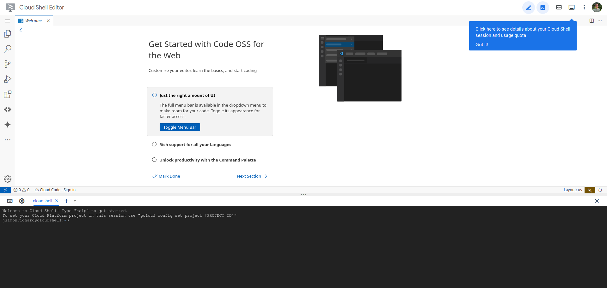

# Using the Linux Terminal

The Linux command line is a text interface to your computer. Often referred to as the shell, terminal, console, prompt or various other names, it can give the appearance of being complex and confusing to use. However, the basics are actually quite simple and easy to learn.

**Side note:** If you are interested in learning more about the history of the terminal, read [Section 1.2.10](./ch1.2.10-terminal-origins.md) for more information.

## Accessing the Terminal Over SSH

Most of you are probably running Windows or MacOS on your personal computer, so you will need to access a linux terminal remotely using a Secure Shell (SSH) connection. On Windows, you can do this using [MobaXTerm](./ch1.3.1-mobaxterm.md), [PuTTY](./ch1.3.2-putty.md), or [WinSCP](./ch1.3.3-winscp.md). Read [Section 1.3](./ch1.3-ssh-turnin.md) for more information on how to access CSU's Linux servers.

### Using Google Cloud Shell

You also have the option of using Google Cloud Shell, which is free. Simply go to <https://shell.cloud.google.com/>. After the shell is provisioned, you should see the environment below:



Your linux shell should be available at the bottom of the page.


## Running your First Command

To run your first command, click inside the terminal window to ensure it's active, then type the following in lowercase and press Enter:

    pwd


This will display your current directory path (likely something like `/home/YOUR_USERNAME`), followed by the prompt text again.

The prompt indicates the terminal is ready for your next command. When you see references to "command prompt" or "command line," they simply mean the place where you type commands in the terminal.

When you run a command, any output will typically appear in the terminal. Some commands display a lot of text, while others may not show anything if they complete successfully. If a new prompt appears right away, the command likely succeeded.

## Navigating the Linux Environment

The `pwd` command (print working directory) shows your current location in the file system. The working directory is where file operations take place by default unless specified otherwise. To check where you are, use `pwd`.

To change the working directory, use `cd` (change directory):

- Move to the root directory:
  ```
  cd /
  pwd
  ```

- Move to the "home" directory from root:
  ```
  cd home
  pwd
  ```

- Go up one level to the parent directory:
  ```
  cd ..
  pwd
  ```

- To return to your home directory (also represented by the `~` path):
  ```
  cd
  pwd
  ```

You can also move up multiple levels:
```
cd ../..
pwd
```

To go directly to the "etc" directory from your home directory:
```
cd # this is same as cd ~
cd ../../etc
pwd
```

Paths can be relative (depending on your current directory) or absolute (starting with `/`).

Most examples so far have used relative paths, meaning the location you navigate to depends on your current directory. For instance, moving to the "etc" directory works from the root:

```
cd /
cd etc
```

But if you're in your home directory and try `cd etc`, you'll get an error because the command is relative to your current location. 

Absolute paths, however, work regardless of your current directory. These paths start with a `/`, indicating the root directory. For example:

```
cd /etc
```

This will always take you to the "etc" directory, no matter where you are. Similarly, running `cd` alone returns you to your home directory. Another absolute path shortcut is using `~`, which refers to your home directory:

```
cd ~
cd ~/Desktop
```

## Creating and Opening Folders and Files

To safely experiment with files, let's create a directory away from your home folder:

```bash
mkdir /tmp/tutorial
cd /tmp/tutorial
```

This creates a new directory, "tutorial," inside `/tmp` using an absolute path. Now, let's create a few subdirectories:

```bash
mkdir dir1 dir2 dir3
```

This command creates multiple directories at once. If you'd like to create nested directories, use the `-p` option (short for "make all **P**arent directories"):

```bash
mkdir -p dir4/dir5/dir6
```

Here, `-p` ensures parent directories (`dir4` and `dir5`) are created if they don't exist. 

To create folders with spaces in the names, use quotes or a backslash to escape the space:

```bash
mkdir "folder 1"
mkdir folder\ 3
```

Avoid spaces in file names where possible by using underscores or hyphens for easier command-line use.


## Listing and Creating Files

Let's create some files and work with them. Start by listing the contents of your current directory:

```bash
ls
```

To capture the output of this command into a file, use redirection (`>`):

```bash
ls > output.txt
```

This creates a file called `output.txt` with the list of directory contents. To view the file:

```bash
cat output.txt
```

The `echo` command can also create files with content:

```bash
echo "This is a test" > test_1.txt
echo "This is a second test" > test_2.txt
echo "This is a third test" > test_3.txt
```

You can view their contents using `cat`. To combine multiple files:

```bash
cat test_1.txt test_2.txt test_3.txt > combined.txt
cat combined.txt
```

Wildcards simplify commands when file names follow patterns. For example, these commands all achieve the same result:

```bash
cat test_?.txt
cat test_*
```

If you want to append text to an existing file, use `>>`:

```bash
echo "Appending a line" >> combined.txt
cat combined.txt
```

To view long files one page at a time, use `less`:

```bash
less combined.txt
```

You can navigate using arrow keys and exit with `q`. This basic workflow helps in creating and managing files with content efficiently.

## Case Sesitivity

Unix systems are case-sensitive, meaning files like `A.txt` and `a.txt` are treated as entirely different. For example:

```bash
echo "Lower case" > a.txt
echo "Upper case" > A.TXT
echo "Mixed case" > A.txt
```

This creates three distinct files. It’s best to avoid file names that only differ by case to prevent confusion, especially when transferring files to case-insensitive systems like Windows. There, all three names would be treated as the same file, which could lead to data loss.

Rather than relying on upper case names (which would require frequent Caps Lock toggling), many users stick to lower case file names. This prevents case-related issues and keeps typing consistent with most shell commands, which are lower case. This habit helps avoid complications and reduces the chances of filename collisions.

### Nope, don't wanna Shout.

A good practice for file naming on Unix systems is to use only lower-case letters, numbers, underscores, and hyphens. File names typically include a dot followed by a few characters as the file extension (e.g., `.txt`, `.jpg`). Sticking to this pattern avoids issues with case sensitivity and escaping, and simplifies command-line usage. Although it may seem limiting, this approach will save time and prevent errors when working in the terminal regularly.

## File Manipulation

#### Moving Files:
- To move a file into a directory:
    ```bash
    mv combined.txt dir1
    ```
- To move it back to the current directory:
    ```bash
    mv dir1/* .
    ```

#### Moving Multiple Files:
- To move several files and directories at once:
    ```bash
    mv combined.txt test_* dir3 dir2
    ```

#### Moving Across Nested Directories:
- To move `combined.txt` from one directory to another nested location:
    ```bash
    mv dir2/combined.txt dir4/dir5/dir6
    ```

#### Copying Files:
- To copy a file from one location to the current directory:
    ```bash
    cp dir4/dir5/dir6/combined.txt .
    ```

- To create a copy with a different name:
    ```bash
    cp combined.txt backup_combined.txt
    ```

#### Renaming Files:
- To rename `backup_combined.txt` to `combined_backup.txt`:
    ```bash
    mv backup_combined.txt combined_backup.txt
    ```

#### Renaming Directories:
- To rename directories (use the Up Arrow for quicker edits):
    ```bash
    mv "folder 1" folder_1
    mv "folder 2" folder_2
    ```

Use `ls` to verify the results of each operation. These commands help manage files and folders efficiently without needing to change directories or use the mouse.

#### Deleting Files:
- To delete files:
```bash
rm dir4/dir5/dir6/combined.txt combined_backup.txt
```

#### Deleting Directories:
- To delete directories, use `rmdir` for empty folders:
```bash
rmdir folder_*
```

- If a directory contains files or subdirectories, `rmdir` will fail. To delete non-empty directories, use `rm` with the recursive `-r` option:
```bash
rm -r folder_6
```
This is a quick and efficient way to clean up files and folders without unnecessary repetition.

#### Safety Warning

When using the `rm` command, be extremely cautious, as it permanently deletes files without moving them to a trash folder. Accidental deletions can easily occur, especially when using wildcards. For example, `rm t*` deletes all files starting with "t," while `rm t *` could delete everything in the directory.

To prevent unintended deletions, consider using the `-i` (interactive) option with `rm`. This option prompts you to confirm each deletion, allowing you to type Y to delete, N to keep, or Ctrl-C to cancel the operation. Always double-check your commands before executing them to avoid irreversible loss.

**Recursive Deletion:**
Be especially cautious when using `rm -r`, as it will delete everything within the directory, including all files and subdirectories. It’s often safer to explicitly delete files first and remove the directory afterward.

## Piping

Modern computers and phones have advanced capabilities, yet text remains crucial for organizing files, from filenames to metadata. The Linux command line offers powerful tools for text manipulation, particularly through *piping*, which allows the output of one command to feed directly into the input of another.

### Piping examples:

1. **Count Files in a Directory**:
   To count the number of lines in an output without creating a temporary file (which is required for `>` redirection), use:
   ```bash
   ls ~ | wc -l
   ```
1. **View Large Outputs**:
   For lengthy outputs, use `less`:
   ```bash
   ls /etc | less
   ```
1. **Find Unique Lines**:
   To count unique lines in `combined.txt`, chain commands:
   ```bash
   cat combined.txt | uniq | wc -l
   ```
   If few duplicates are removed, it’s likely because `uniq` only removes adjacent duplicates.
1. **Check Command Documentation**:
   Use the `man` command for details on how commands work:
   ```bash
   man uniq
   ```
1. **Sort Before Uniquing**:
   To prepare for using `uniq`, sort the file first:
   ```bash
   sort combined.txt | uniq | wc -l
   ```
1. **Searching for a string in an input**:
   To search for a string in a file, use `grep`:
   ```bash
   cat combined.txt | grep "string"
   ```
