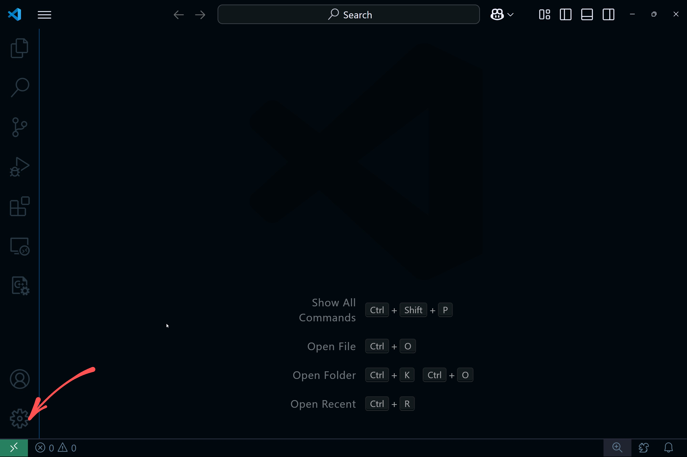
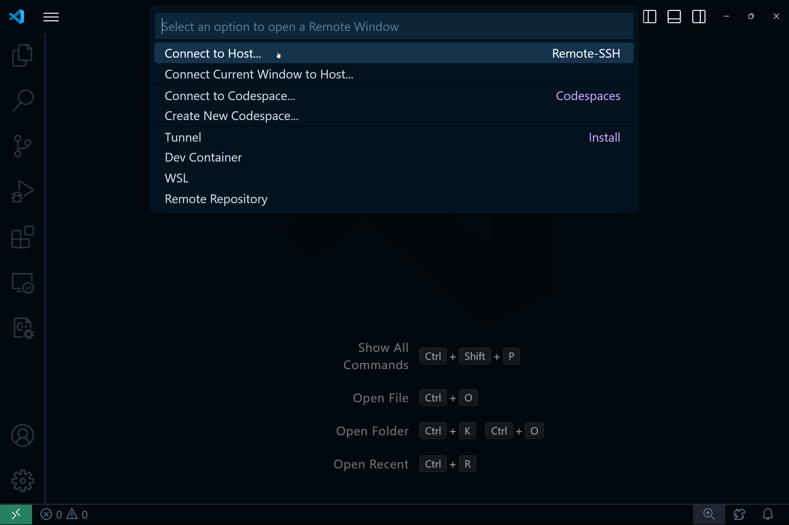
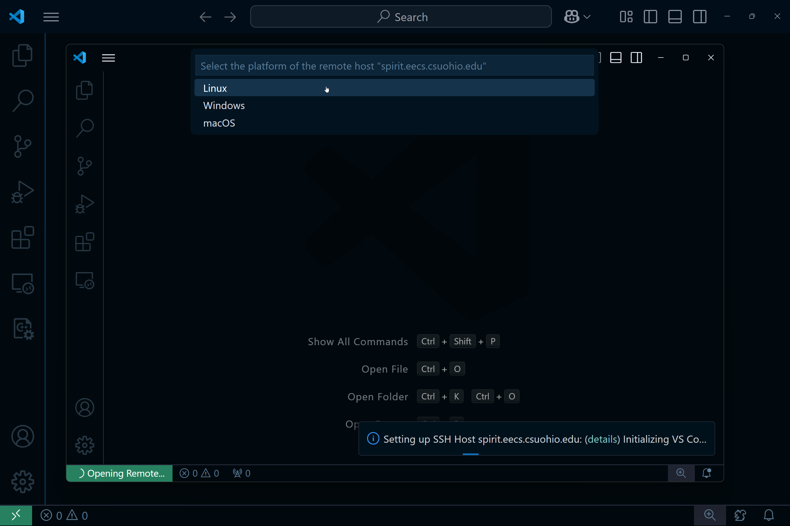
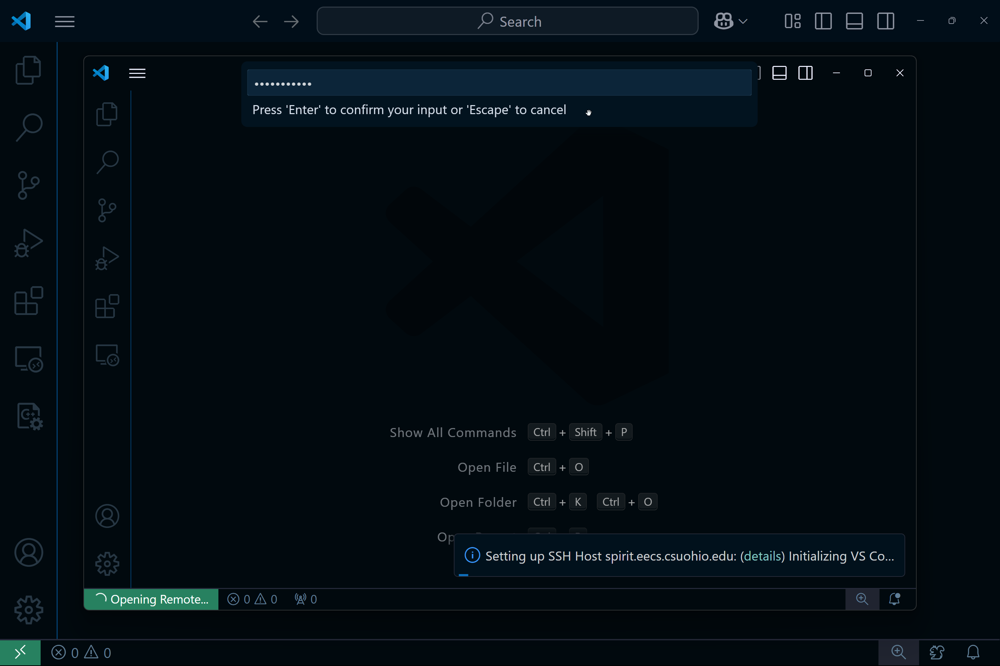
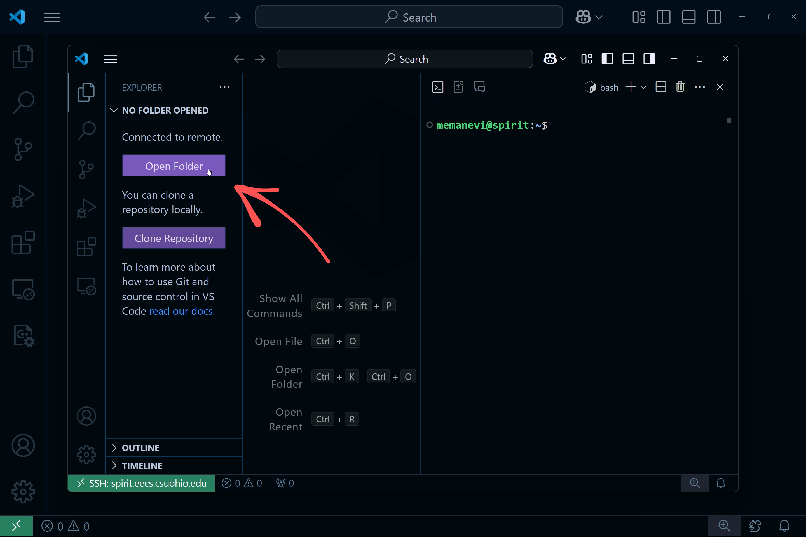
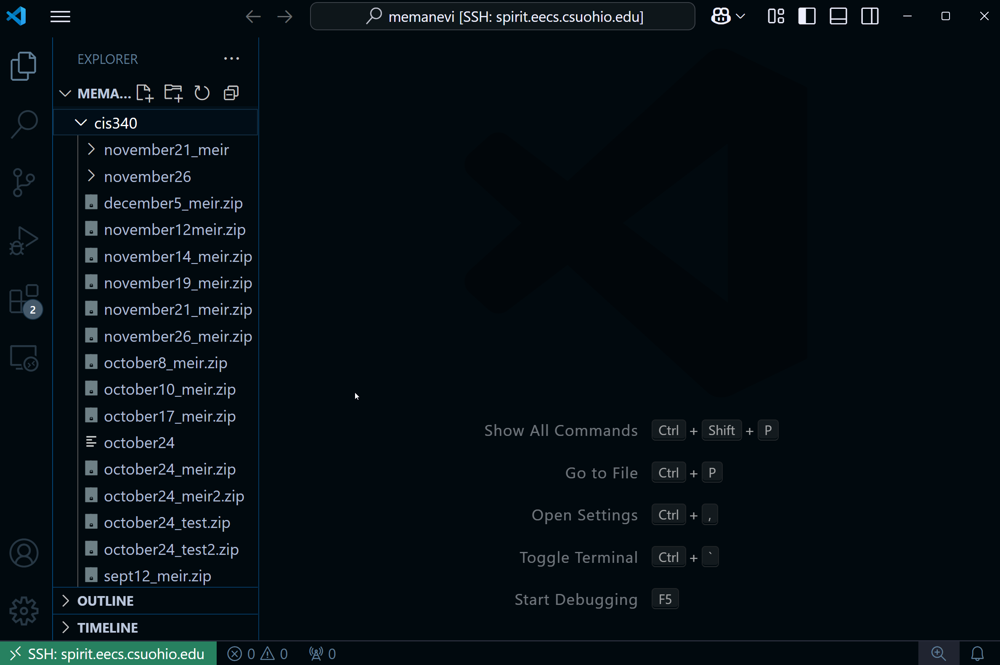
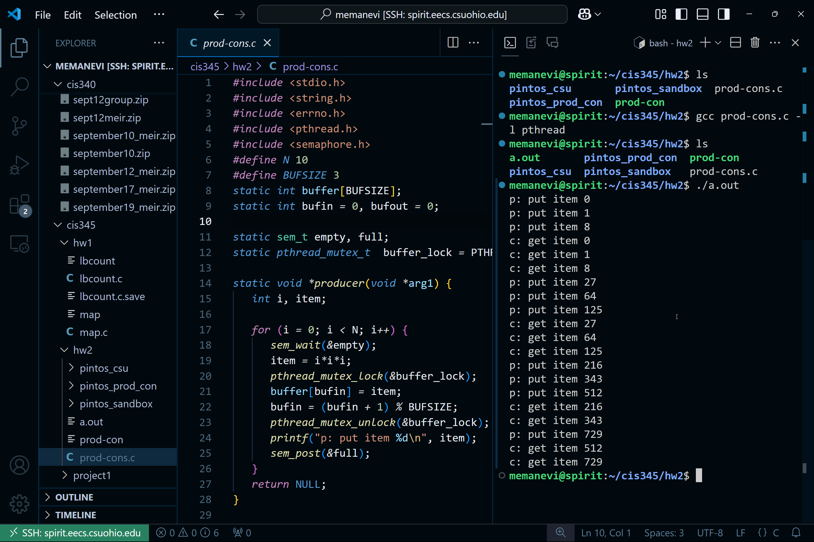

# Editing your files on Grail through VSCode

You can edit files that are on the CSU Linux computers directly through VSCode, instead of editing locally and then using `scp` each time you want to upload them.

## Accessing SSH through VSCode

Open VSCode and click on the "Open a Remote Window" button on the bottom left:

Then select the "Connect to Host" option:

Type in your CSU Linux ssh path `username@spirit.eecs.csuohio.edu` and hit enter.
This will open a new window and you will be prompted to choose the operating system. Select Linux:

Enter your password:

And you should be in! Next, select "Open Folder":

Your home directory should autopopulate. Click the OK button and enter your password again, and allow VSCode to trust the authors if prompted. You should now have access to all of your files on CSU's Linux computers, with some new files there for VSCode to work:

You can now edit any file by just selecting it through the file explorer on the left, and you can hit `ctrl+~` to open the terminal, which will be the spirit terminal, on which you cann compile and run your programs using gcc as you make changes in the editor:

