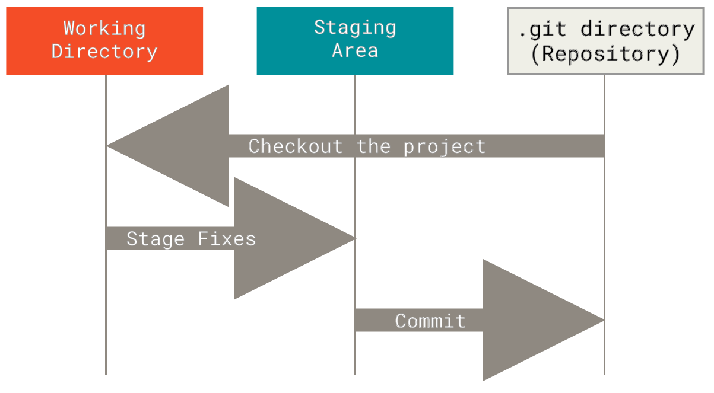

# What is git?

Git is a distributed version control system (VCS) that helps developers track and manage changes in their code over time. With Git, every time you commit, or save the state of your project, Git basically takes a picture of what all your files look like at that moment and stores a reference to that snapshot. To be efficient, if files have not changed, Git doesn’t store the file again, just a link to the previous identical file it has already stored. Git thinks about its data more like a stream of snapshots. [^1]

This may seem innocuous, but it's actually vital to the development cycle. Virtually all professional code is managed by some VCS, and git is by far the most common.

# Terms to know

- **Repository (Repo)**: A directory or storage space where your project lives, including all files and version history tracked by Git. Your _local_ repository is your project’s history stored on your computer. A _remote_ repository is a version of your project hosted on the internet or network.
- **Working Directory**: The directory on your local machine where you modify files before tracking them with Git
- **Commit**: A snapshot of your repository at a specific point in time, including all staged changes.
- **The Three States**: Git has three main states that your files can reside in: modified , staged , and committed
  - **Modified** means that you have changed the file but have not committed it to your database yet.
  - **Staged** means that you have marked a modified file in its current version to go into your next commit snapshot.
  - **Committed** means that the data is safely stored in your local database.
    
    https://git-scm.com/book/en/v2/Getting-Started-What-is-Git
- **Branches**: branches are parallel versions of your project. They allow you to work on different features or fixes independently without affecting the main project until you’re ready to merge them back.
- **Pull Request**: a pull request is a way to propose changes from one branch to another. It’s a request to review, discuss, and possibly merge the changes into the target branch, and is often used in team collaborations.
- **Merge**: merging is the process of integrating changes from one branch into another. It combines the histories of both branches, creating a single, unified history.

## Use cases

### Tracking file changes over time

Have you ever been scared to work on your code after completing a feature because you didn't break it? Git fixes this by allowing you to take a snapshot (or "commit") of your code, which you can always go back to by running a single command (`git checkout ...` or `git reset ...`).

Making multiple commits (best practice is a commit for each feature) throughout the progression of a project allows you to revert at any time to any "milestone." You'll never lose your work again[^2].

### Working on different versions of your code at the same time

Git branches allow you to work on multiple versions of your code base at the same time. For example, if you want to maintain an old, released version (e.g. adding security patches) while continuing feature development for the latest version, you could create a branch called `v1.0.0` and a branch called `dev`.

By default, git repositories have one branch named `master` or `main`. This is often used either for development or for the latest stable version of the software.

### Code collaboration

Branches (or forked repositories on a platform like GitHub) can be used by multiple developers to collaborate on the same code base. Usually, each developer works on their own branch and implements a feature. Once that feature is complete, they _merge_ the branch into the `main` or `master` branch.

### Storing code remotely

Git can be used with platforms like [GitHub](https://github.com) or [GitLab](https://gitlab.com) to manage code stored in the cloud. This is an important part of the modern development cycle.

Typically, a developer creates a branch, implements their feature (or reaches some stopping point), and then commits their changes. After they commit their changes, they _push_ it up to the server hosting the main code base so that others can access it.

For smaller projects, developers may skip the "creating a branch" step and commit new code directly to the `main` branch.

[^1]: https://git-scm.com/book/en/v2/Getting-Started-What-is-Git%3F
[^2]: Unless you delete or lose the git repository itself, or manually delete commits.
