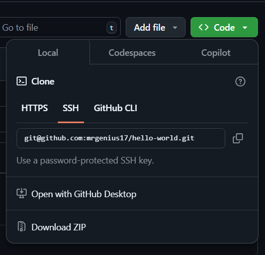

# Creating a GitHub Account

GitHub is a web-based platform that uses Git for version control, allowing you to store, manage, and collaborate on code projects. Follow these steps to create an account:

1. **Go to GitHub**: Open your web browser and navigate to [GitHub](https://github.com/).
2. **Sign Up**: Click on the **Sign Up** button in the top-right corner.
   > &nbsp;&nbsp;&nbsp;&nbsp;
3. **Enter Your Details**: Provide a username, email address, and password.
4. **Verify Your Account**: Complete the CAPTCHA challenge and click **Create account**.
5. **Check Your Email**: GitHub will send a verification email. Open it and click the confirmation link.
6. **Choose a Plan**: You can select the free plan or a paid plan with additional features.
7. **Customize Your Experience** _(Optional)_: GitHub may ask questions about your experience level and interests. Answer them or skip this step.

Once completed, you now have a GitHub account and can start creating repositories to manage your code.

---

## Creating Your First Repository

A repository (repo) is where your project files and version history are stored. Follow these steps to create your first repository on GitHub:

1. **Log In**: Go to [GitHub](https://github.com/) and sign in to your account.
2. **Create a New Repository**: Click on the **+** icon in the top-right corner and select **New repository**.
   > &nbsp;&nbsp;&nbsp;&nbsp;
3. **Repository Name**: Enter a name for your repository. It should be descriptive of your project.
   > &nbsp;&nbsp;&nbsp;&nbsp;
4. **Description** _(Optional)_: Provide a brief summary of what your project is about.
5. **Choose Visibility**:

   - **Public**: Anyone can see your repository.
   - **Private**: Only you and collaborators can access it.
     > &nbsp;&nbsp;&nbsp;&nbsp;

6. **Initialize the Repository** _(Optional)_: You can check **Add a README file** to create a default file that describes your project.

   > &nbsp;&nbsp;&nbsp;&nbsp;

7. **Choose a Git Ignore** _(Optional)_: Select a `.gitignore` template to automatically exclude common files that shouldn’t be tracked.
   > &nbsp;&nbsp;&nbsp;&nbsp;
8. **Choose a License** _(Optional)_: Pick a license if you want to specify terms for using and sharing your code.

   > &nbsp;&nbsp;&nbsp;&nbsp;

9. **Create Repository**: Click the **Create repository** button.

Your repository is now ready! You can start adding files, cloning it to your local machine, or collaborating with others.

# Connect GitHub Account with your Local git with SSH Keys

## Start the SSH Agent Service

#### Windows

In Powershell, start the ssh service:

```Powershell
Start-Service ssh-agent
```

If that does not work, open **Powershell as Administator** and run:

```Powershell
Get-Service ssh-agent | Set-Service -StartupType Manual
Start-Service ssh-agent
Get-Service ssh-agent
```

After successful execution, it should say the service is running.

#### Linux

In the terminal, check if the ssh service is running:

```bash
eval "$(ssh-agent -s)"
```

## Generate SSH Key Pair

Run this command:

```bash
ssh-keygen -t ed25519
```

A password is not required, nor a file location. Keep hitting enter until a key is generated.

This creates a pair of keys:

- Private key: `~\.ssh\id_ed25519`
- Public key: `~\.ssh\id_ed25519.pub`

## Add Private Key to SSH Agent

Run this command to add the private SSH Key to SSH Agent:

#### Linux
```bash
ssh-add ~/.ssh/id_ed25519
```

#### Windows
```Powershell
ssh-add "$env:USERPROFILE\.ssh\id_ed25519"
```

## Get the Public Key Content

Print the public key content to the terminal and copy it:

Linux:
`cat ~/.ssh/id_ed25519.pub`

Windows:
`type ~/.ssh/id_ed25519.pub`

## Add the Public Key to your GitHub Account

- In the upper-right corner of any page on GitHub, click your profile photo, then click Settings.
- In the "Access" section of the sidebar, click SSH and GPG keys.
- Click New SSH key or Add SSH key.
- In the "Title" field, add a descriptive label for the new key. For example, if you're using a personal laptop, you might call this key "Personal laptop".
- Let the type of key selection be default, i.e. authentication.
- In the "Key" field, paste your public key.
- Click Add SSH key.
- If prompted, confirm access to your account on GitHub.

## Test the Connection

Test the connection to github:

```bash
ssh -T git@github.com
```

Successful connection should say:

```
Hi <username>! You've successfully authenticated, but GitHub does not provide shell access.
```

## Cloning a Repository Locally

To clone a repository locally, follow these steps:

1. First, navigate to the directory where you want to clone the repository:
   ```bash
   cd /path/to/your/directory
   ```
2. Get the repository URL:
   - Go to the GitHub repository page.
   - Click on the Code button.
   - Under Clone, click on the SSH Tab, and copy the URL.
     > &nbsp;&nbsp;&nbsp;&nbsp;
3. Clone the repository by using the git clone command followed by the copied repository URL:
   ```bash
   git clone https://github.com/username/repository-name.git
   ```
4. This will create a new folder with the repository name and download all files into it. You can then navigate into the cloned repository:
   ```bash
   cd repository-name
   You can now work with the repository locally.
   ```
