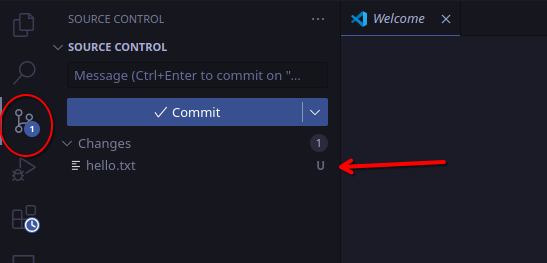

# Using git

## Creating a repository locally

Before you proceed, you will need to create a git repository. You can do that by creating a repository on GitHub and cloning (described in [Section 2.2](./ch2.2-create-github-account.md)) or by creating one locally using the following commands:

```bash
mkdir my_repo
cd my_repo
git init
```

## Creating and Committing Files

First, let's makes a file.

```bash
echo "hello world" > hello.txt
```

We now have the `hello.txt` file containing "hello world." Because we have not yet committed this file, it is in the "untracked" state (underneath the "modified" / "working directory" state described in [Section 2](./ch2-git.md)).

You can check this by running git's `status` command.

```bash
$ git status
On branch main

No commits yet

Untracked files:
  (use "git add <file>..." to include in what will be committed)
	hello.txt

nothing added to commit but untracked files present (use "git add" to track)
```
You can also see this using the git panel in VS Code.



Before we commit this file, we need to add it to staging.

```bash
git add hello.txt
```

Alternatively, you can add all changes to staging using this command:
```bash
git add . # "." refers to the current directory
```

This process allows you to choose which files are included in each commit (instead of automatically adding all modified files to the current commit).

Let's check git's status again.
```bash
$ git status
On branch main

No commits yet

Changes to be committed:
  (use "git rm --cached <file>..." to unstage)
        new file:   hello.txt
```

Next, let's make our commit.

```bash
git commit -m "My first commit!" # -m specifies the commit message
```

> **TIP:** For commit messages do you not use past tense, such as "I made headings blue". Use language like "Make headings blue", as if you are giving orders to the codebase.

Here are a few other commit examples.


The commits of a project (including multiple branches) can be organized into a "commit tree", which looks something like this:


## Branches

Branches allow you to work on different versions of your project simultaneously without affecting the main codebase

From this main code you can create branches, this allows you to make changes without the chance of ruining the main code. Think of it as a copy of your code that you can now change with zero risks.


Let's create a new branch using this command:

`git checkout -b darshan/feature-a`

You should now be on the `darshan/feature-a` branch. You can check this by running the `git branch` command.

Next, let's add a change to this branch

```bash
echo "foo bar" > foo.txt
git add .
git commit -m "Add foo.txt"
```

Let's go back to the `main` branch.

```bash
git checkout main
```

Note that the `foo.txt` file is no longer present.
```bash
$ ls
hello.txt
```

### Merging Branches

To update the `main` branch with the changes from `darshan/feature-a`, run this command.

```bash
$ git merge darshan/feature-a
Updating f365571..0d24068
Fast-forward
 foo.txt | 1 +
 1 file changed, 1 insertion(+)
 create mode 100644 foo.txt
```

If the files modified in `main` and `darshan/feature-a` (after `darshan/feature-a` was created or after the last merge) are mutually exclusive, then git should be able to do this automatically. However, if the same file was modified in both branches, you will encounter a merge conflict. Let's test this.

First, we'll make a change on the `main` branch.

```bash
echo "Hello CSU" >> hello.txt # >> appends to an existing file
git add .
git commit -m "Update hello.txt"
```

Next, let's make a change on the `darshan/feature-a` branch without updating (merging) the new changes on `main`.

```bash
echo "Hello engineering students!" >> hello.txt
git add .
git commit -m "Update hello.txt 2"
```

Now let's try to merge this.

```bash
$ git checkout main
$ git merge darshan/feature-a
Auto-merging hello.txt
CONFLICT (content): Merge conflict in hello.txt
Automatic merge failed; fix conflicts and then commit the result.
```

Before you do anything else, you will need to fix the merge conflicts. Git represents these conflicts within each file using the following format

```ini
# hello.txt
hello world
<<<<<<< HEAD
Hello CSU
=======
Hello engineering students!
>>>>>>> darshan/feature-a
```

To resolve this, replace the text above with the final desired version (it could be one or the other, or a combination of both). Once you've resolved all of the conflicts in (and saved) each file, stage the files and create a new commit. This completes the merge process.

For example, edit `hello.txt` like this:

```ini
# hello.txt
hello world
Hello CSU
Hello engineering students
```

Then run these commands:
```bash
git add .
git commit -m "Merge feature-a into main"
```

**Note:** you can also use `git commit` without a commit message. It will then open an editor for you the write the commit message. once you save the message and exit the editor, git will make the commit. 

Afterwards, you may delete `darshan/feature-a`.

```bash
git branch -d darshan/feature-a
```

## Remotes

First, make sure that you've created your repo through GitHub (see [Section 2.2](./ch2.2-create-github-account.md)). Alternatively, you can create another GitHub repo (with no files) and then add it as a remote to your current repo. 

More coming soon...

#### Troubleshooting: Merging with remote branches

```
From github.com:gaverkov/mixed_volumes_proposal
 * branch            main       -> FETCH_HEA
hint: You have divergent branches and need to specify how to reconcile them.
hint: You can do so by running one of the following commands sometime before
hint: your next pull:
hint:
hint:   git config pull.rebase false  # merge
hint:   git config pull.rebase true   # rebase
hint:   git config pull.ff only       # fast-forward only
hint:
hint: You can replace "git config" with "git config --global" to set a default
hint: preference for all repositories. You can also pass --rebase, --no-rebase,
hint: or --ff-only on the command line to override the configured default per
hint: invocation.
```
